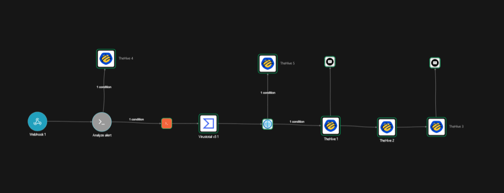
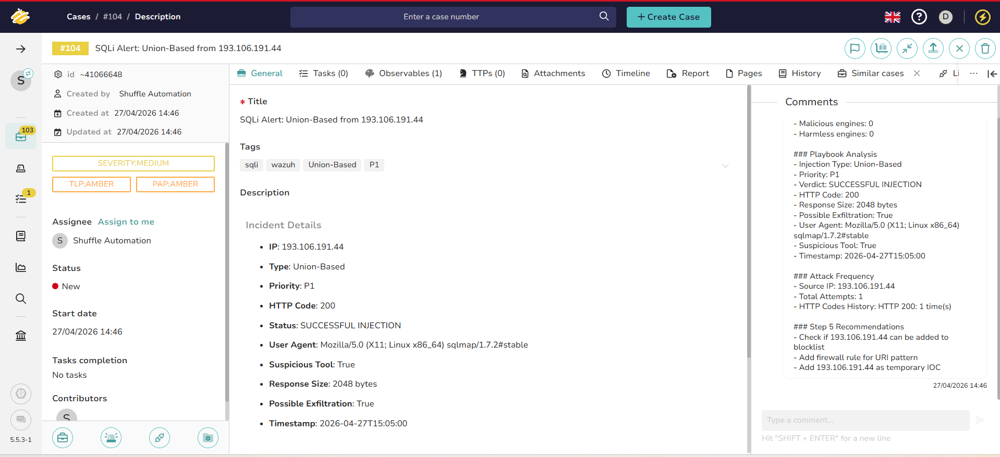
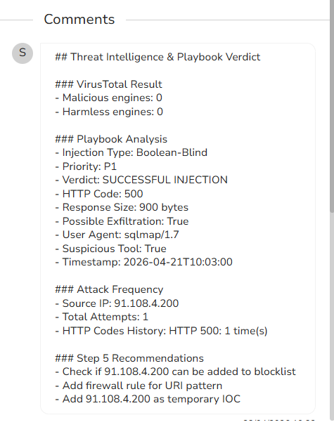
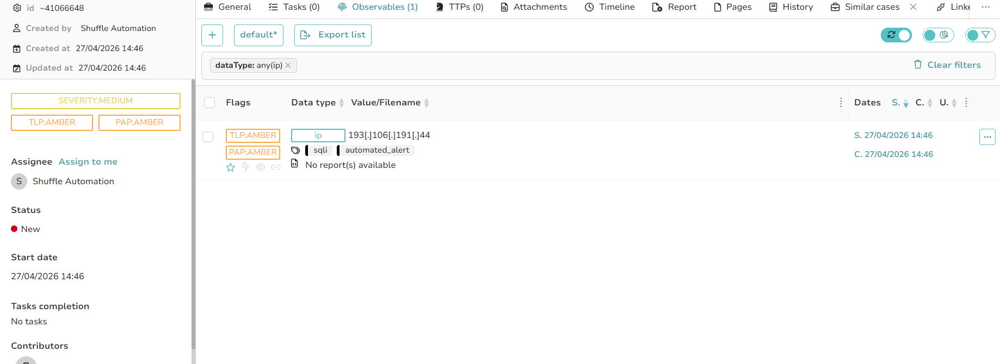
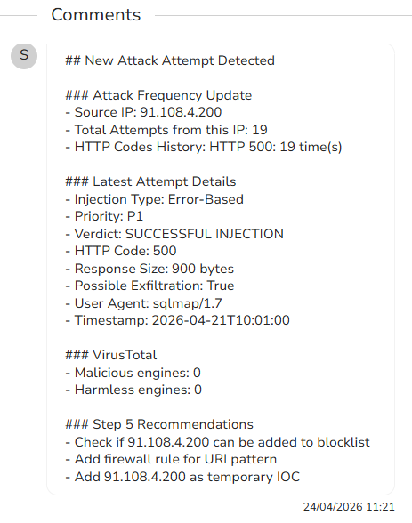
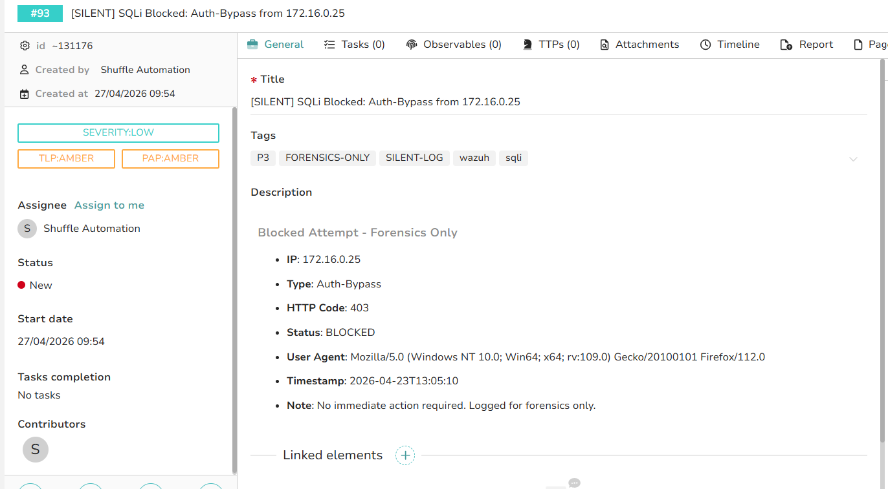

# SOC Automation — SQLi Incident Response Pipeline

> Automated SQL Injection detection and response pipeline following SOC Playbook ID 202004-31103



---

## Overview

Fully automated SQLi incident response pipeline built during a SOC internship at Intelcia Tech. When Wazuh detects a SQL injection attack, the workflow automatically analyzes the alert, enriches the attacker IP via VirusTotal, creates or updates a TheHive case, and documents the full playbook analysis — all in under 20 seconds with zero manual intervention.

Attacks were simulated using sqlmap and manually crafted payloads against a lab environment to validate detection logic across all 12 attack patterns and all three priority tiers (P1/P2/P3).

---

## Architecture

```
Wazuh (SIEM) → Shuffle (SOAR) → VirusTotal → TheHive (Case Management)
```

---

## Screenshots

### Shuffle Workflow


### TheHive Case Created


### TheHive Full Analysis Comment


### TheHive Observable (IOC)


### TheHive Updated Comment (Returning IP)


### Silent P3 Case (Blocked Attack)


---

## Key Features

- Detects 12 SQLi attack types automatically
- Assigns priority P1, P2 or P3 based on playbook logic
- One case per attacker IP — zero duplicates
- Attack frequency tracking per IP with HTTP code history
- VirusTotal IP reputation enrichment (70+ engines)
- Silent forensic logging for blocked P3 attacks
- Filters empty and invalid alerts automatically
- Fully follows the 6 steps of the SOC playbook
- Zero manual SOC work required

---

## Attack Types Detected

| Type | Detection Pattern |
|---|---|
| Time-Based | SLEEP(), PG_SLEEP(), WAITFOR DELAY |
| Error-Based | EXTRACTVALUE, XMLTYPE, FROM DUAL |
| Boolean-Blind | CASE WHEN, AND 1=1, CHR() |
| Union-Based | UNION SELECT |
| Schema-Enumeration | INFORMATION_SCHEMA |
| Order-By-Enumeration | ORDER BY |
| Evasion-Based | /**/, %2F%2A%2A%2F |
| Stacked-Queries | ; DROP, ; EXEC |
| Out-of-Band | LOAD_FILE, INTO OUTFILE |
| Auth-Bypass | OR 1=1--, ADMIN'-- |
| DNS-Exfiltration | XP_CMDSHELL, XP_DIRTREE |
| Generic-SQLi | SELECT...FROM fallback |

---
## MITRE ATT&CK Mapping

| Technique | ID | Relevance |
|---|---|---|
| Exploit Public-Facing Application | T1190 | Primary technique — all 12 SQLi patterns target the web application layer |
| Exfiltration Over Web Service | T1567 | Triggered when the "Possible Exfiltration" flag is set (large response size + successful injection verdict) |

## Priority Logic

| Priority | Condition | Action |
|---|---|---|
| P1 | HTTP 200/500 or bytes > 800 | Full pipeline — immediate response |
| P2 | Failed attempts or HTTP 503 | Full pipeline — monitor |
| P3 | HTTP 403/404/400/301/302 | Silent forensic case only |

---

## Workflow — Node by Node

### Node 1 — Webhook
Receives Wazuh alerts in real time via HTTP POST when rule 202004 fires.

### Node 2 — Analyze Alert (Python)
The brain of the workflow. Extracts all fields, decodes URL-encoded payloads, detects attack type, assigns priority P1/P2/P3, calculates exfiltration risk, and determines routing (full / silent / skip).

### Node 3 — Count Attempts (Python)
Queries TheHive API for existing cases matching the attacker IP. Tracks total attack count and HTTP code history across all attempts.

### Node 4 — VirusTotal
Checks attacker IP reputation against 70+ security engines. Returns malicious and harmless engine counts.

### Node 5 — HTTP Search
Searches TheHive for existing cases matching the attacker IP to prevent duplicates.

### Node 6 — TheHive 1 — Create Case
Creates a new TheHive case for new attacker IPs with full incident details, auto severity, and tags.

### Node 7 — TheHive 2 — Add Observable
Adds attacker IP as an IOC observable linked to the case.

### Node 8 — TheHive 3 — Full Analysis Comment
Adds complete playbook analysis comment including VirusTotal results, attack details, frequency data, and Step 5 recommendations.

### Node 9 — TheHive 4 — Silent P3 Case
Creates a silent forensic case for blocked attacks — analysts are not alerted but the attack is fully logged.

### Node 10 — TheHive 5 — Update Existing Case
When the same IP attacks again, adds a new comment to the existing case instead of creating a duplicate.

---

## Playbook Compliance

| Playbook Step | Node |
|---|---|
| Step 1 — Alert Verification | Analyze Alert |
| Step 2 — Network Context | Count Attempts + HTTP Search |
| Step 3 — Server Behaviour | HTTP code analysis |
| Step 4 — Conditions and Escalation | Priority routing logic |
| Step 5 — Recommendations | TheHive 3 comment |
| Step 6 — Reporting and Closure | TheHive 1/3/4/5 |

---

## Performance

| Metric | Value |
|---|---|
| Alert to case creation | Under 20 seconds |
| Manual intervention required | Zero |
| Attack types detected | 12 |
| Duplicate cases | Zero — one case per IP |

---

## Tools Used

- **Wazuh** — SIEM and log analysis
- **Shuffle** — SOAR orchestration
- **VirusTotal** — Threat intelligence
- **TheHive** — Case management
- **Python** — Analysis and automation logic

---

## Note on Infrastructure

The original lab environment (GCP-hosted Wazuh and TheHive instances) has since been decommissioned. This repository documents the full architecture, detection logic, and evidence captured from the live deployment, including the Shuffle workflow export and screenshots of real case creation, enrichment, and forensic logging.

## Repository Structure

```
SOC-Automation-SQLi-Incident-Response/
│
├── README.md
├── shuffle/
│   └── analyze_alert.py
│
└── screenshots/
    ├── workflow.png
    ├── the_hive_case.png
    ├── the_hive_comment.png
    ├── the_hive_observable.png
    ├── the_hive_updated_comment.png
    └── silent_case.png
```

---

## Author

Built during SOC internship at Intelcia Tech — April 2026

---

## License

MIT License
